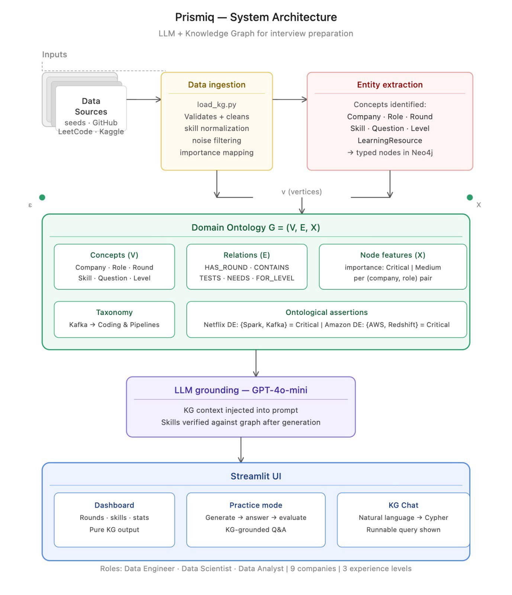

# Prismiq — AI-Powered Interview Preparation Platform

Prismiq combines **Knowledge Graphs (Neo4j)** and **LLMs (GPT-4o-mini)** to deliver personalized, company-specific interview preparation for **Data Scientist**, **Data Engineer**, and **Data Analyst** roles at 9 top tech companies.

> **Zero GPT content in the Knowledge Graph** — all data sourced from real platforms. LLM used only at runtime for generation + evaluation.

---

## Architecture



The system follows a formal ontology-driven design modeled as **G = (V, E, X)**:

| Component | Description |
|-----------|-------------|
| **V** (Concepts) | Company · Role · Round · Skill · Question · Level · LearningResource |
| **E** (Relations) | HAS_ROUND · CONTAINS · TESTS · NEEDS · FOR_LEVEL · HAS_RESOURCE |
| **X** (Node features) | importance: Critical \| High \| Medium — per (company, role) pair |

```
Data Sources (seeds, GitHub, LeetCode, Kaggle)
        ↓
Data Ingestion — load_kg.py (validates, cleans, normalizes, batched UNWIND)
        ↓
Entity Extraction — 7 concept types → typed nodes in Neo4j
        ↓
Domain Ontology G = (V, E, X) — taxonomy + ontological assertions
        ↓
LLM Grounding — GPT-4o-mini with KG context injected into every prompt
        ↓
Streamlit UI — Dashboard | Practice Mode | KG Chat
```

**KG Stats**: 29,018 nodes · 53,884 relationships · 25,877 skills · 2,919 questions · 455 tests passing

---

## How It Works

```
User selects Company + Role + Experience Level
        ↓
Knowledge Graph (Neo4j) retrieves relevant rounds, skills, and questions
        ↓
LLM (GPT-4o-mini) generates a targeted question using KG context
        ↓
User answers → LLM evaluates with role-specific scoring rubrics
        ↓
KG reasoning path explains WHY this question was asked
        ↓
Recommended resources surfaced from Skill → HAS_RESOURCE → LearningResource
```

---

## Features

### Dashboard
Company-role overview with experience-level-adaptive round cards, skill pills (Must Have / Good to Have), and quick stats.

### Practice Mode
Full question → answer → evaluate cycle with:
- KG-grounded question generation with metadata (round, difficulty, skills)
- Expandable hints
- Color-coded score ring (green 8+, amber 5–7, red <5)
- Strengths, areas for improvement, model answer
- Skills to improve + next steps
- "Why This Question?" KG reasoning path

### KG Chat
Natural language queries against the Knowledge Graph with full Cypher trace visibility:
- *"What rounds does Google have for Data Engineer?"*
- *"What skills are critical for Data Scientist at Amazon?"*
- *"Resources to prepare for SQL interviews"*

---

## Data Sources

| Source | What it provides | Count |
|--------|-----------------|-------|
| Glassdoor / Blind / Levels.fyi | Interview round structures (hand-verified) | 162 rounds (27 combos × 6) |
| LeetCode (GitHub CSVs) | Company-tagged coding problems | 450 questions |
| GitHub Repos | DS/DE interview questions (markdown) | 2,469 questions |
| Kaggle Job Postings | Skill frequencies per role × company | 31,143 unique skills |
| Manual Curation | Learning resources with real URLs | 45 resources |

---

## Project Structure

```
Prismiq/
├── config.py                  # Central configuration (roles, companies, mappings)
├── models.py                  # Pydantic models for validation
├── data/
│   ├── kaggle_extract.py      # LeetCode + Kaggle skill extraction
│   ├── github_extract.py      # GitHub interview question extraction
│   ├── job_market_extract.py  # Kaggle job market skill processing
│   ├── resources.py           # 45 curated learning resources
│   ├── raw/                   # Raw source files
│   └── processed/             # Output JSON files
├── kg/
│   ├── schema.py              # Neo4j constraints (7), indexes (5), driver
│   ├── load_kg.py             # Batched UNWIND loader + graph-native classification
│   ├── kg_retrieval.py        # Parameterized Cypher for RAG context
│   └── kg_chat.py             # NL query → intent detection → Cypher routing
├── llm/
│   ├── seeds.py               # 27 interview round structures (9 companies × 3 roles)
│   ├── generator.py           # Role-aware question generation
│   ├── evaluator.py           # Role-aware answer evaluation with scoring rubrics
│   ├── round_filter.py        # Experience-level round filtering
│   └── chat.py                # KG context → natural language synthesis
├── app/
│   └── app.py                 # Streamlit UI (Dashboard, Practice Mode, KG Chat)
├── tests/
│   ├── conftest.py            # Neo4j fixtures, --neo4j flag
│   ├── test_config_models.py  # 23 tests: config, settings, Pydantic models
│   ├── test_seeds.py          # 210+ tests: seed coverage, round structure, normalization
│   ├── test_kg_integrity.py   # 180+ tests: schema, nodes, relationships, classification
│   └── test_chat_resources.py # 28 tests: intent detection, entity extraction, resources
├── .env.example
├── requirements.txt
└── README.md
```

---

## Setup

```bash
git clone https://github.com/riyanshikedia10/Prismiq.git
cd Prismiq
python3 -m venv venv
source venv/bin/activate
pip install -r requirements.txt
cp .env.example .env   # Add your OpenAI API key + Neo4j credentials
```

### Load the Knowledge Graph

```bash
# Step 1: Extract data from sources
python data/kaggle_extract.py        # LeetCode problems
python data/github_extract.py        # GitHub interview questions
python data/job_market_extract.py    # Kaggle skill frequencies

# Step 2: Load into Neo4j (batched UNWIND — takes ~2 min on Aura)
python kg/load_kg.py

# Step 3: Launch the app
streamlit run app/app.py
```

### Run Tests

```bash
# Unit tests only (no Neo4j required)
pytest tests/ -v

# Full suite including KG integrity tests
pytest tests/ -v --neo4j
```

---

## Tech Stack

| Layer | Technology |
|-------|-----------|
| Knowledge Graph | Neo4j Aura (Cypher) |
| LLM | OpenAI GPT-4o-mini |
| Frontend | Streamlit |
| Data Validation | Pydantic |
| Testing | pytest (455 parametrized tests) |
| Language | Python 3.12 |

---

## Team

**Nidhi Nair** · **Riyanshi Kedia** · **Tirth Patel**

DAMG 7374: LLM with Knowledge Graph DB — Northeastern University, Spring 2026
